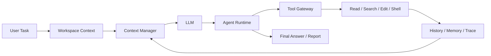

# zzcode — Lightweight Repository-Aware Coding Agent

`zzcode` 是一个面向本地代码仓库的轻量 Coding Agent。它围绕真实工作区执行 **观察 → 决策 → 工具调用 → 修改 → 验证** 的多步循环，并通过 Context、Memory、Approval、Checkpoint 与 Evaluation 提升 Agent 的可控性和可恢复性。

> **Coding Agent · Agent Harness · Tool Use · Context Engineering · Memory · Evaluation**

---

## Architecture



核心流程：

**感知仓库 → 构建上下文 → 模型决策 → 工具执行 → 结果回写 → 继续执行或结束**

---

## Core Features

### Agent Runtime & Tool Use

- 基于显式 Agent Loop 调度模型调用、工具执行、step budget 与停止条件。
- 提供 `list_files`、`read_file`、`search`、`write_file`、`patch_file`、`run_shell` 等仓库工具。
- 所有工具统一经过参数校验、路径约束和风险控制，高风险操作支持 `ask / auto / never` 三种审批策略。

### Context & Memory

- 按需读取仓库内容，而不是一次性把完整代码库塞入 Prompt。
- Context 按 Stable Prefix、Working Memory、Relevant Memory、History、Current Request 分区管理，并在超预算时进行压缩。
- 使用 Working / Episodic / Durable 三层记忆，并通过文件 freshness 检查避免恢复时使用过期状态。

### Reliability & Recovery

- Session 支持继续之前的工作。
- 每次 Run 保存 `task_state.json`、`trace.jsonl` 和 `report.json`，便于追踪执行过程。
- 通过 Checkpoint、workspace fingerprint 和 freshness mismatch 检查处理上下文压缩与恢复场景。
- 支持 Ollama、OpenAI-compatible 和 Anthropic-compatible 模型后端。

---

## Evaluation

项目包含固定的 Coding Agent regression benchmark，通过 **fixture + step budget + verifier** 验证 Agent Harness，而不是只依赖模型自评。

当前 `benchmarks/coding_tasks.json` 包含 **12 个确定性任务**，主要覆盖：

| Category | Coverage |
| --- | --- |
| Basic Editing | README / 文本定向修改 |
| Tool Boundary | invalid patch、path escape、重复读取 |
| Context Recovery | 上下文压缩与 Checkpoint |
| Resume Recovery | freshness / workspace mismatch |
| Durable Memory | 稳定事实晋升与异常内容拒绝 |

相关实现：`zzcode/evaluator.py`、`zzcode/metrics.py`、`benchmarks/coding_tasks.json`。

---

## Key Modules

| Module | Responsibility |
| --- | --- |
| `runtime.py` | Agent Loop 与任务调度 |
| `context_manager.py` | Context 构建、预算与压缩 |
| `memory.py` | Working / Episodic / Durable Memory |
| `tools.py` | Tool Registry、校验与安全边界 |
| `models.py` | 多模型 Provider 适配 |
| `workspace.py` | 工作区与 Git 上下文 |
| `evaluator.py` / `metrics.py` | Agent Evaluation 与指标 |

更完整的流程与实现说明见 [`docs/zzcode-interview-flow.md`](docs/zzcode-interview-flow.md)。

---

## Quick Start

需要 Python 3.10+。

```bash
uv sync
uv run zzcode
```

指定其他代码仓库：

```bash
uv run zzcode --cwd /path/to/repo
```

执行一次性任务：

```bash
uv run zzcode "inspect the test failures and propose a fix"
```

常用运行参数：

```bash
zzcode --approval ask
zzcode --max-steps 20
zzcode --max-new-tokens 4096
```

模型后端可通过 `--provider ollama|openai|anthropic` 切换，API Key 与模型配置通过环境变量或 `.env` 提供。

---

## Project Structure

```text
zzcode/
├── zzcode/                  # Agent Runtime / Context / Memory / Tools
├── benchmarks/              # Coding Agent regression tasks
├── tests/
├── docs/
├── scripts/
├── pyproject.toml
└── README.md
```

## Development

```bash
uv run pytest
uv run ruff check .
```
