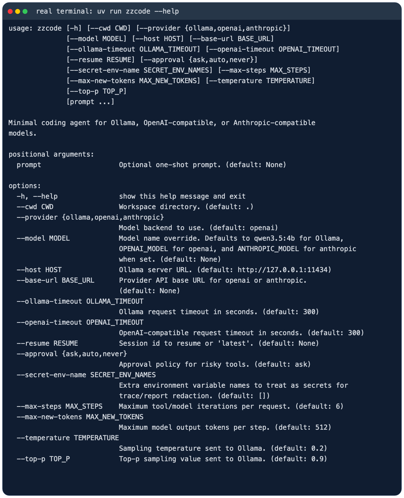
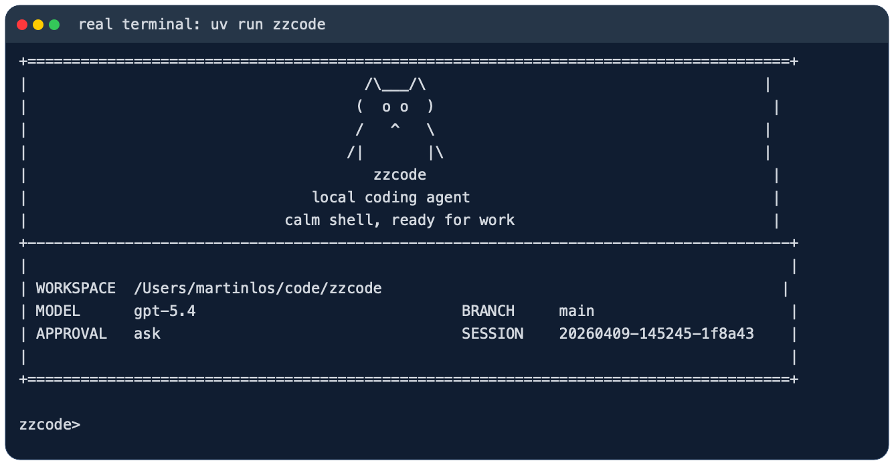
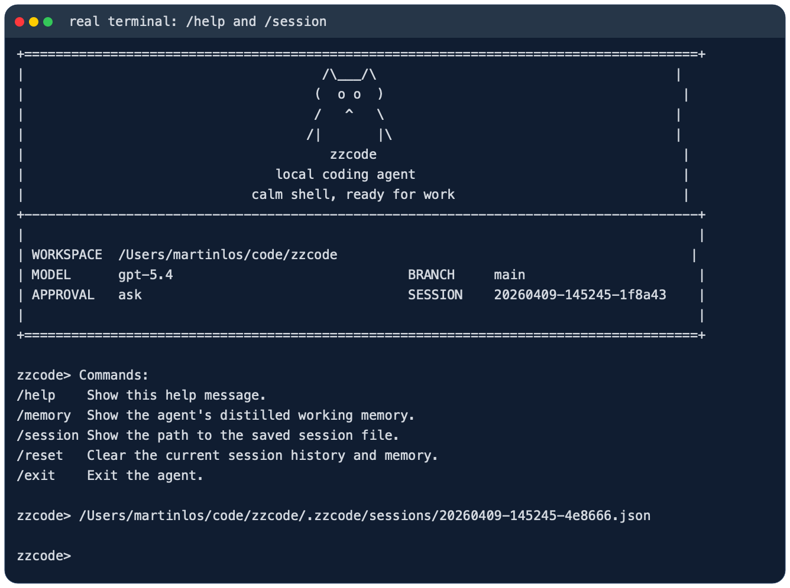

# zzcode

`zzcode` 是一个面向代码仓库的轻量本地 coding agent。它直接跑在终端里，先看当前工作区，再用一组受约束的工具去读文件、改文件、跑命令，并把会话状态保存在本地 `.zzcode/` 目录里。

它更像一个能在仓库里持续工作的命令行助手，不是纯聊天窗口。你可以拿它做代码排查、测试修复、仓库分析，或者让它在当前项目里执行一次性的工程任务。

## 适合做什么

- 在本地仓库里排查测试失败
- 读取当前代码结构并给出修改建议
- 基于现有文件做小步迭代，而不是脱离仓库空想
- 在会话中保留上下文，支持继续上一次工作

## 主要特性

- 包名是 `zzcode`
- CLI 命令是 `zzcode`
- 模块入口是 `python -m zzcode`
- 会话保存在 `.zzcode/sessions/`
- 每次运行的工件保存在 `.zzcode/runs/<run_id>/`
- 支持三类模型后端：
  - Ollama
  - OpenAI 兼容 Responses API
  - Anthropic 兼容 Messages API

## 使用截图

CLI 帮助信息：



启动界面：



REPL 内置命令与会话路径：



## 安装

需要 Python 3.10+。

如果你用 `uv`，直接安装依赖：

```bash
uv sync
```

如果你已经在自己的 Python 环境里工作，也可以直接装成可编辑模式：

```bash
pip install -e .
```

## 快速开始

在当前仓库里启动交互模式：

```bash
uv run zzcode
```

指定另一个工作目录：

```bash
uv run zzcode --cwd /path/to/repo
```

直接跑一次性任务：

```bash
uv run zzcode "inspect the test failures and propose a fix"
```

如果当前环境已经安装过包，也可以直接这样启动：

```bash
python -m zzcode
```

## 模型后端

### Ollama

```bash
ollama serve
ollama pull qwen3.5:4b
uv run zzcode --provider ollama --model qwen3.5:4b
```

### OpenAI 兼容接口

```bash
export OPENAI_API_BASE="https://your-api.example/v1"
export OPENAI_API_KEY="your-api-key"
export OPENAI_MODEL="gpt-5.4"
uv run zzcode --provider openai
```

### Anthropic 兼容接口

```bash
export ANTHROPIC_API_BASE="https://www.right.codes/claude/v1"
export ANTHROPIC_API_KEY="your-api-key"
export ANTHROPIC_MODEL="claude-sonnet-4-6"
uv run zzcode --provider anthropic
```

如果你的服务端对多个兼容接口复用了同一套密钥，`zzcode` 也支持从 `ANTHROPIC_API_KEY` 回退到 `RIGHT_CODES_API_KEY` 或 `OPENAI_API_KEY`。

### 使用 `.env`

`zzcode` 会优先加载自身项目根目录中的 `.env`。因此无论从哪个文件夹运行，都可以复用同一份模型配置：

```env
OPENAI_API_KEY=your-api-key
OPENAI_API_BASE=https://your-api.example/v1
OPENAI_MODEL=gpt-5.4
```

配置完成后，可以在任意目录直接运行：

```bash
zzcode
```

复杂目录检查默认最多允许 10 次工具调用。需要更大预算时可以使用：

```bash
zzcode --max-steps 20
```

推理模型的思考过程也会占用输出预算。默认预算为 2048 token；如果模型提示只返回 reasoning 而没有最终文本，可以提高：

```bash
zzcode --max-new-tokens 4096
```

如果实际工作目录中也有 `.env`，它只会补充全局配置中缺少的变量。终端已经设置的环境变量始终优先。也可以通过 `ZZCODE_ENV_FILE` 指定另一份全局配置文件。

`.env` 默认被 Git 和 agent 的文件扫描忽略，也不允许通过文件读取工具送入模型上下文。可以提交不含真实密钥的 `.env.example` 作为配置模板。

## 常用交互命令

- `/help`：查看内置命令
- `/memory`：查看提炼后的工作记忆
- `/session`：查看当前会话文件路径
- `/reset`：清空当前会话状态
- `/exit` 或 `/quit`：退出 REPL

## 安全与持久化

`zzcode` 不会默认把所有动作都放开。像 shell 执行、文件写入这类高风险操作，会受审批模式控制：

- `--approval ask`
- `--approval auto`
- `--approval never`

每次运行结束后，都会在 `.zzcode/runs/<run_id>/` 下写出这些文件：

- `task_state.json`
- `trace.jsonl`
- `report.json`

这些内容默认只保存在本地，不需要跟仓库一起提交。

## 开发

如果装了 Ruff，可以这样检查：

```bash
uv run ruff check .
```
