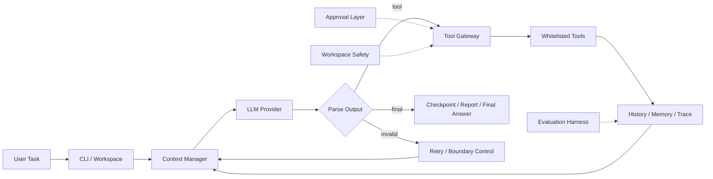

# zzcode — Lightweight Repository-Aware Coding Agent

`zzcode` 是一个运行在本地代码仓库中的轻量 Coding Agent。它不是单纯的聊天 CLI，而是一个带有 **Agent Runtime、受约束工具调用、Context Engineering、分层 Memory、Checkpoint / Resume、Approval Boundary 与 Evaluation Harness** 的仓库级智能执行系统。

它会先感知当前工作区，再由模型在受控 Agent Loop 中决定下一步动作，通过白名单工具读取、搜索、修改代码或执行命令，并持续记录任务状态、Trace 与运行报告。

> **Positioning:** Coding Agent · Agent Harness · Tool Use · Context Engineering · Memory · Reliability Evaluation

---

## Overview



一条主线可以概括为：

**感知仓库 → 构建上下文 → 模型决策 → 工具执行 → 状态沉淀 → 恢复 / 评测**

与直接把整个代码仓库塞进 Prompt 不同，`zzcode` 使用按需探索（lazy inspection）：先提供稳定的工作区快照，再由 Agent 根据当前任务逐步读取真正需要的文件。

---

## Key Features

### 1. Repository-aware Agent Runtime

`ZZCode.ask()` 负责完整的多步控制循环：

1. 接收用户任务并创建独立 Run；
2. 构建当前 Prompt 与任务状态；
3. 调用模型；
4. 将输出解析为 `tool`、`final` 或 retry；
5. 工具结果写回 History / Memory；
6. 继续下一轮直到完成、达到 step budget 或触发边界条件；
7. 保存最终 Checkpoint 与 Report。

模型负责“下一步做什么”，Runtime 负责 **预算、安全、解析、状态、工具执行与停止条件**。

### 2. Explicit Tool Boundary

Agent 不直接调用底层 Python 函数，而是通过统一 Tool Gateway 使用显式注册的能力白名单：

| Tool | Capability | Risk |
| --- | --- | --- |
| `list_files` | 浏览工作区 | Low |
| `read_file` | 按行读取文本文件 | Low |
| `search` | 在仓库内检索内容 | Low |
| `run_shell` | 在仓库根目录执行命令 | High |
| `write_file` | 写入文本文件 | High |
| `patch_file` | 精确替换单个文本块 | High |
| `delegate` | 委托受限只读子 Agent 调查 | Bounded |

工具调用统一经过存在性检查、参数校验、路径约束、防重复与审批策略。`patch_file` 要求 `old_text` 精确命中且仅出现一次，使修改行为尽可能确定、可解释。

### 3. Approval & Safety

高风险操作不会默认完全开放，支持三种审批模式：

```text
--approval ask    # 高风险操作询问用户
--approval auto   # 自动允许
--approval never  # 拒绝高风险操作
```

同时实现了工作区路径边界、私密环境文件隔离、Shell 环境过滤、工具步数限制以及受限的只读子 Agent，减少模型越界访问和非预期副作用。

### 4. Context Engineering

`ContextManager` 将 Prompt 拆成多个具有不同优先级和预算的区域：

```text
Stable Prefix
    ↓
Working Memory
    ↓
Relevant Memory
    ↓
Compressed History
    ↓
Current Request
```

核心策略包括：

- 稳定 Prefix 与工作区快照复用；
- 分区预算，而不是简单截断完整历史；
- 最近历史优先保留；
- 重复文件读取结果可压缩；
- 文件摘要通过 freshness 校验避免使用过期状态；
- 当前请求始终放在最后并优先保护。

这使 Agent 可以在多轮工具调用后继续保留真正与任务相关的信息，而不是无限扩张上下文。

### 5. Layered Memory

`zzcode` 将完整会话历史与可复用记忆分离：

- **Working Memory**：当前任务摘要、最近文件和新鲜文件摘要；
- **Episodic Memory**：跨步骤 / 跨轮的过程事实与操作笔记；
- **Durable Memory**：显式晋升后的长期项目约定、关键决策和稳定事实。

文件被修改后，旧摘要会失效；恢复 Session 时也会重新检查 freshness，避免 Agent 基于过期代码状态继续执行。

### 6. Checkpoint, Resume & Observability

每次 Run 都会生成可审计工件：

```text
.zzcode/runs/<run_id>/
├── task_state.json
├── trace.jsonl
└── report.json
```

其中记录：

- 模型调用与工具步骤；
- stop reason；
- Prompt / Context metadata；
- Checkpoint；
- workspace / freshness 恢复状态；
- 最终执行报告。

Session 保存在 `.zzcode/sessions/`，支持恢复之前的工作，而不是把每次调用都当成无状态请求。

### 7. Multi-provider Model Adapter

Runtime 通过统一模型接口隔离不同 Provider 协议差异，目前支持：

- Ollama
- OpenAI-compatible Responses API
- Anthropic-compatible Messages API

核心 Agent Loop 不依赖具体模型供应商，因此可以在本地模型与远程模型之间切换，而无需修改控制逻辑。

---

## Evaluation & Reliability

`zzcode` 不只关注“能不能跑”，还为 Agent Harness 的稳定性设计了固定回归任务与 verifier。

当前 `benchmarks/coding_tasks.json` 包含 **12 个确定性 regression tasks**，覆盖：

| Category | Example |
| --- | --- |
| Documentation | README 定向修改 |
| Text Edit | 精确 patch 文件内容 |
| Tool Boundary | invalid patch、path escape、重复读取恢复 |
| Context Recovery | 上下文压缩后创建 Checkpoint 并继续任务 |
| Resume Recovery | freshness mismatch、workspace mismatch |
| Durable Memory | 稳定事实晋升、临时 / secret-shaped 内容拒绝 |

每个任务定义固定 fixture、允许工具、step budget、预期产物和 verifier，用确定性结果验证 Harness、Context、Memory 与 Recovery，而不是仅依赖模型自评。

相关实现：

```text
benchmarks/coding_tasks.json
zzcode/evaluator.py
zzcode/metrics.py
scripts/run_large_scale_experiments.py
scripts/run_provider_experiments.py
```

---

## Example Workflow

一个典型 Coding Agent 任务：

```text
User: inspect the test failures and propose a fix

        ↓

Workspace snapshot
        ↓
search / read_file
        ↓
identify relevant implementation
        ↓
patch_file / write_file
        ↓
run_shell (tests)
        ↓
observe result
        ↓
retry or finish
        ↓
report.json + final answer
```

和一次性代码生成不同，`zzcode` 的重点是让模型围绕 **真实仓库状态** 循环执行“观察 → 修改 → 验证”，并把每一步放在可控的平台边界内。

---

## Screenshots

### CLI Help


### Startup


### REPL & Session


更完整的项目流程图见：[`docs/zzcode-interview-flow.md`](docs/zzcode-interview-flow.md)

---

## Architecture Map

| Layer | Module | Responsibility |
| --- | --- | --- |
| CLI / Composition Root | `zzcode/cli.py` | 参数解析、Provider 选择、Session 创建与恢复 |
| Agent Runtime | `zzcode/runtime.py` | 模型调用、工具循环、边界与 Checkpoint 调度 |
| Context Engineering | `zzcode/context_manager.py` | Prompt 分区、预算、压缩与相关记忆召回 |
| Memory | `zzcode/memory.py` | Working / Episodic / Durable Memory |
| Tool Boundary | `zzcode/tools.py` | 工具注册、参数校验、安全与执行 |
| Model Adapter | `zzcode/models.py` | Ollama / OpenAI / Anthropic 协议适配 |
| Task State | `zzcode/task_state.py` | attempts、tool steps、stop reason、checkpoint |
| Run Store | `zzcode/run_store.py` | Trace、TaskState、Report 持久化 |
| Workspace | `zzcode/workspace.py` | Git / 项目文档快照与 workspace fingerprint |
| Evaluation | `zzcode/evaluator.py`, `zzcode/metrics.py` | Benchmark、verifier 与指标聚合 |

---

## Quick Start

需要 Python 3.10+。

### Install

使用 `uv`：

```bash
uv sync
```

或安装为 editable package：

```bash
pip install -e .
```

### Run in Current Repository

```bash
uv run zzcode
```

指定工作目录：

```bash
uv run zzcode --cwd /path/to/repo
```

执行一次性任务：

```bash
uv run zzcode "inspect the test failures and propose a fix"
```

如果已经安装包：

```bash
zzcode
# or
python -m zzcode
```

---

## Model Backends

### Ollama

```bash
ollama serve
ollama pull qwen3.5:4b
uv run zzcode --provider ollama --model qwen3.5:4b
```

### OpenAI-compatible API

```bash
export OPENAI_API_BASE="https://your-api.example/v1"
export OPENAI_API_KEY="your-api-key"
export OPENAI_MODEL="your-model"

uv run zzcode --provider openai
```

### Anthropic-compatible API

```bash
export ANTHROPIC_API_BASE="https://your-api.example/v1"
export ANTHROPIC_API_KEY="your-api-key"
export ANTHROPIC_MODEL="your-model"

uv run zzcode --provider anthropic
```

### `.env`

`zzcode` 会优先加载自身项目根目录中的 `.env`。终端已经设置的环境变量优先，也可以通过 `ZZCODE_ENV_FILE` 指定其他配置文件。

```env
OPENAI_API_KEY=your-api-key
OPENAI_API_BASE=https://your-api.example/v1
OPENAI_MODEL=your-model
```

`.env` 默认被 Git 和 Agent 文件扫描忽略，也不会通过文件读取工具进入模型上下文。

---

## Runtime Controls

复杂仓库任务可以调整工具步数预算：

```bash
zzcode --max-steps 20
```

调整模型输出预算：

```bash
zzcode --max-new-tokens 4096
```

常用 REPL 命令：

```text
/help       查看内置命令
/memory     查看工作记忆
/session    查看当前 Session
/reset      清空当前会话状态
/exit       退出
```

---

## Project Structure

```text
zzcode/
├── zzcode/
│   ├── cli.py
│   ├── runtime.py
│   ├── context_manager.py
│   ├── memory.py
│   ├── tools.py
│   ├── models.py
│   ├── task_state.py
│   ├── run_store.py
│   ├── workspace.py
│   ├── evaluator.py
│   └── metrics.py
├── benchmarks/
│   └── coding_tasks.json
├── docs/
│   ├── zzcode-interview-flow.md
│   └── zzcode-interview-flow.html
├── scripts/
├── tests/
├── assets/
├── pyproject.toml
└── README.md
```

---

## Design Boundaries

当前项目刻意保持轻量，因此也有明确边界：

- Workspace 使用按需探索，而不是预先为整个代码库建立索引；
- Context budget 当前采用字符预算，不等同于精确 tokenizer token budget；
- Memory retrieval 以透明的词法与标签匹配为主，不依赖向量数据库；
- Coding quality 最终仍受底层模型能力影响，Harness 主要负责提高过程的可控性、可恢复性和可观察性。

这些取舍让核心 Agent Runtime 保持简单、可理解、可测试，也便于继续扩展更复杂的模型、检索和执行能力。

---

## Development

运行 Ruff：

```bash
uv run ruff check .
```

运行测试：

```bash
uv run pytest
```
