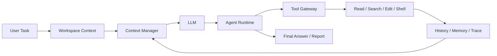

# zzcode — 轻量级本地 Coding Agent Harness

**技术栈：** Agent Harness · Tool Calling · Context Management · Memory · Checkpoint · Trace

面向代码仓库级任务构建本地 Coding Agent Harness，围绕 **Agent Loop、工具调用、上下文与记忆管理、任务恢复及执行追踪** 设计核心机制，提升长任务执行中的上下文可控性、状态连续性与工具调用安全性。

---

## Architecture


```mermaid
flowchart LR
    U[User Task] --> W[Workspace Context]
    W --> C[Context Manager]
    C --> M[LLM]
    M --> R[Agent Runtime]
    R --> T[Tool Gateway]
    T --> X[Read / Search / Edit / Shell]
    X --> S[History / Memory / Trace]
    S --> C
    R --> F[Final Answer / Report]
```

核心流程：

**感知仓库 → 构建上下文 → 模型决策 → 工具执行 → 结果回写 → 继续执行或结束**

---

## Core Features

### Agent Runtime & Tool Use

- 基于显式 Agent Loop 调度模型调用、工具执行、step budget 与停止条件。
- 提供 `list_files`、`read_file`、`search`、`write_file`、`patch_file`、`run_shell` 等仓库工具。
- 所有工具统一经过参数校验、路径约束和风险控制，高风险操作支持 `ask / auto / never` 三种审批策略。
- 使用原生工具协议：OpenAI Responses、Claude Messages、Ollama Chat。一次响应可包含多个工具调用，按顺序执行并关联结果。
- 最终答案为普通文本；已移除自定义文本标签与 XML 工具解析。后端需要支持原生 Tool Calling。

### Context & Memory

- 按需读取仓库内容，而不是一次性把完整代码库塞入 Prompt。
- Context 按 Stable Prefix、Working Memory、Relevant Memory、History、Current Request 分区管理，并在超预算时进行压缩。
- 使用 Working / Episodic / Durable 三层记忆，并通过文件 freshness 检查避免恢复时使用过期状态。

### Reliability & Recovery

- Session 支持继续之前的工作。
- 每次 Run 保存 `task_state.json`、`trace.jsonl` 和 `report.json`，便于追踪执行过程。
- 通过 Checkpoint、workspace fingerprint 和 freshness mismatch 检查处理上下文压缩与恢复场景。
- 支持 Ollama、OpenAI-compatible 和 Anthropic-compatible 模型后端。

---

## Evaluation

`zzcode/evaluation/` 实现真实仓库任务推理和独立评分；根目录 `evaluation/` 保存任务、配置与环境。评测系统的测试集中在 `tests/evaluation/`，与其他产品测试共用入口。`zzcode/benchmarks/` 用于确定性机制回归及诊断实验，两类结果分别统计。

项目包含固定的 Coding Agent regression benchmark，通过 **fixture + step budget + verifier** 验证 Agent Harness，而不是只依赖模型自评。

当前 `benchmarks/coding_tasks.json` 包含 **12 个确定性任务**，主要覆盖：

| Category | Coverage |
| --- | --- |
| Basic Editing | README / 文本定向修改 |
| Tool Boundary | invalid patch、path escape、重复读取 |
| Context Recovery | 上下文压缩与 Checkpoint |
| Resume Recovery | freshness / workspace mismatch |
| Durable Memory | 稳定事实晋升与异常内容拒绝 |

---

## Key Modules

| Module | Responsibility |
| --- | --- |
| `zzcode/agent/` | Coordinator、单一 Agent Loop、运行契约、事件和完成策略 |
| `zzcode/context/` | 工作区上下文、Token 预算、压缩及分层记忆 |
| `zzcode/core/` / `zzcode/providers/` | 原生消息类型与 OpenAI、Anthropic、Ollama 适配 |
| `zzcode/execution/` | 工具 Gateway、操作账本、文件操作与 Local/Docker 执行器 |
| `zzcode/storage/` | Session、Checkpoint 和 Run 工件存储 |
| `zzcode/evaluation/` | 真实仓库任务推理、Patch 收集、独立评分与报告 |
| `zzcode/benchmarks/` | 确定性回归任务和机制实验指标 |
| `zzcode/cli.py` | 命令行入口、依赖装配与输出模式 |

---

## Quick Start

Python 3.10+。

```bash
uv sync
uv run zzcode
```

指定其他代码仓库：

```bash
uv run zzcode --cwd /path/to/repo
```

执行一次性任务：

```bash
uv run zzcode "inspect the test failures and propose a fix"
```

常用运行参数：

```bash
zzcode --approval ask
zzcode --max-steps 20
zzcode --max-new-tokens 4096
```

模型后端可通过 `--provider ollama|openai|anthropic` 切换，API Key 与模型配置通过环境变量或 `.env` 提供。

---

## Project Structure

```text
zzcode/
├── zzcode/                     # 产品源码
│   ├── agent/                  # coordinator、loop、contracts、events、policy、state
│   ├── context/                # workspace、manager、budget、compaction、memory
│   ├── core/                   # 消息／工具协议与敏感路径定义
│   ├── providers/              # 原生模型协议适配
│   ├── execution/              # gateway、ledger、tools、Local/Docker Executor
│   ├── storage/                # session、runs
│   ├── evaluation/             # 推理、执行、独立评分、报告和评测 CLI
│   ├── benchmarks/             # 确定性 evaluator 与 metrics
│   ├── cli.py                  # 产品 CLI
│   ├── runtime.py              # 原有运行接口的公共导出
│   └── models.py               # 模型客户端的公共导出
├── tests/                      # 产品与评测系统的统一测试入口
│   ├── agent/ · context/ · execution/ · storage/ · providers/ · benchmarks/
│   ├── evaluation/             # 评测系统的 unit/integration/security/golden 测试
│   └── fixtures/               # 共享协议录制资产
├── evaluation/                 # 真实仓库评测资产
│   ├── configs/                # 推理、评分与迁移配置
│   ├── datasets/               # 公开任务集和数据契约
│   └── environments/           # Docker 镜像与依赖锁定
├── benchmarks/                 # coding_tasks.json：12 个确定性回归任务
├── scripts/
│   ├── testing/                # 各阶段基线、协议与上下文验证
│   ├── evaluation/             # 数据集校验、回归和报告生成
│   ├── experiments/            # Provider、规模与恢复实验
│   └── docs/                   # 文档截图工具
├── docs/
│   ├── architecture/           # 当前结构及架构说明
│   ├── testing/                # P0–P5 验收与测试说明
│   ├── evaluation/             # 评测任务设计
│   ├── review-pack/            # 历史评审材料
│   └── zzcode-upgrade-plan-v2.md
├── artifacts/                  # 冻结的阶段源码与验证证据
├── agent.md                    # 代码风格偏好
├── pyproject.toml
└── uv.lock
```

运行时的 `.zzcode/`、评测 `runs/`、`reports/`、`workspaces/` 和私有评分数据 `private/` 由本地生成，不作为源码目录提交。

完整说明见 [项目目录与运行入口](docs/architecture/project-layout.md)。

### 运行入口与完成策略

SDK 提供 `Agent.run(RunRequest) -> Iterator[AgentEvent]` 与 `run_to_completion() -> AgentResult`；`ZZCode.ask()` 保留原有字符串接口。两种接口共用一个同步循环。

```bash
zzcode --task-type code_change --verify-command "python -m pytest -q" "修复问题"
zzcode --output jsonl --task-type question "解释当前项目"
```

代码修改必须满足配置的验证命令及当前工作区证据，才能标记运行完成；独立评测的 `resolved` 由评分器判断。JSONL stdout 只输出脱敏事件，诊断与审批进入 stderr。


## Documentation

- [当前目录与 SDK 运行入口](docs/architecture/project-layout.md)
- [升级方案与实施进度](docs/zzcode-upgrade-plan-v2.md)
- [P4 运行入口与目录重构验收](docs/testing/p4-result.md)
- [P5 统一执行器验收](docs/testing/p5-result.md)
- [真实仓库评测使用说明](evaluation/README.md)

## Development

```bash
uv run pytest tests -m "not docker and not real_model"
uv run ruff check zzcode scripts tests
```

按范围运行：产品测试使用 `uv run pytest tests --ignore=tests/evaluation`；评测系统测试使用 `uv run pytest tests/evaluation -m "not docker and not real_model"`。真实容器验收使用 `RUN_DOCKER_TESTS=1 uv run pytest tests/evaluation -m docker`。

### Native protocol validation

```bash
uv run pytest tests/providers/test_native_protocol.py tests/benchmarks/test_protocol_golden.py
uv run python scripts/testing/freeze_p1_baseline.py --output artifacts/p1-baseline/new-check
# Uses the configured backend for a read-only tool round trip:
uv run python scripts/testing/run_native_smoke.py --provider openai --output artifacts/p1-baseline/native-smoke.json
```

原生消息保存完整内容块与工具 call ID。恢复旧会话时，旧工具文本作为历史观察，不会重新解析或执行。中断批次的未配对调用记为 `unknown`，需要先检查工作区；P2 已提供独立操作账本及持久化调用结果。签名思考内容只保存在权限为 `0600` 的 Session 中，不进入公开 Trace、Report 或记忆摘要。

P0 历史证据保留在 `artifacts/p0-baseline/verified/`；重放旧协议需使用提交 `464428c`。当前默认迁移配置为 `unified_execution`。

### 工具执行与恢复（P2）

所有工具经过统一 Gateway，返回结构化 `ToolResult`。操作记录保存在工作区 `.zzcode/operations.sqlite3`，文件写入使用原子替换和完整哈希核对；不确定的 Shell 操作会阻止后续写入。

交互模式下用 `/operations` 查看待核对操作；确认实际结果后，输入 `/resolve 操作ID succeeded|failed|cancelled 核对证据`。请先检查文件、进程及外部副作用，再明确记录结果。`--max-run-seconds 300` 设置调用之间检查的时间预算。

输出采用有限读取与脱敏 Artifact，模型可调用 `read_artifact` 分段查看保留内容。恢复边界与验证说明见 [P2 实现记录](docs/testing/p2-result.md)。

### 长会话与上下文压缩（P3）

会话使用版本化 JSONL 保存，旧 JSON 会话首次读取时会备份并迁移，原始历史保留。发送请求前按完整请求估算 Token；超过预算时将旧的完整工具批次转为有来源的事实摘要，保留当前输入和近期结果。

可使用 `--context-window 32768 --max-output-tokens 4096` 显式配置模型容量。默认容量未经后端确认；UTF-8 字节估算较保守。无法容纳必要输入时会明确停止。详见 [P3 实现记录](docs/testing/p3-result.md)。

P4 验证：`uv run python scripts/testing/freeze_p4_baseline.py --output artifacts/p4-baseline/new-check`（输出目录需为空）。

### 统一执行器（P5）

默认使用本机 LocalExecutor；Docker 必须显式指定本地已有镜像，不可用时直接停止。

```bash
zzcode --executor docker --docker-image zzcode-eval-py313:phase4 --task-type code_change --verify-command "python -m pytest -q" "修复问题"
uv run python scripts/testing/freeze_p5_baseline.py --output artifacts/p5-baseline/new-check
```

Docker 禁用网络，使用受控工作区副本，排除凭证、Git、虚拟环境和运行状态；每次命令结束后核对宿主文件再同步修改。依赖应预装在镜像中。SDK 可通过 `Agent(..., executor=DockerExecutor(workspace, image=...))` 注入同一执行器。详见 [P5 实现与验收](docs/testing/p5-result.md)。
