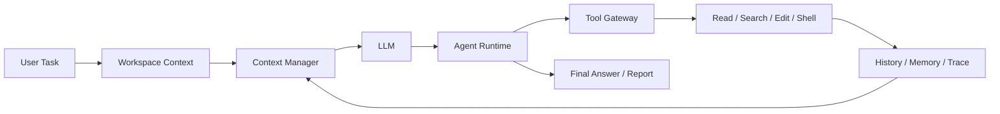

# zzcode — 轻量级本地 Coding Agent Harness

**技术栈：** Agent Harness · Tool Calling · Context Management · Memory · Checkpoint · Trace

面向代码仓库级任务构建本地 Coding Agent Harness，围绕 **Agent Loop、工具调用、上下文与记忆管理、任务恢复及执行追踪** 设计核心机制，提升长任务执行中的上下文可控性、状态连续性与工具调用安全性。

---

## Architecture


```mermaid
flowchart LR
    U[User Task] --> W[Workspace Context]
    W --> C[Context Manager]
    C --> M[LLM]
    M --> R[Agent Runtime]
    R --> T[Tool Gateway]
    T --> X[Read / Search / Edit / Shell]
    X --> S[History / Memory / Trace]
    S --> C
    R --> F[Final Answer / Report]
```

核心流程：

**感知仓库 → 构建上下文 → 模型决策 → 工具执行 → 结果回写 → 继续执行或结束**

---

## Core Features

### Agent Runtime & Tool Use

- 基于显式 Agent Loop 调度模型调用、工具执行、step budget 与停止条件。
- 提供 `list_files`、`read_file`、`search`、`write_file`、`patch_file`、`run_shell` 等仓库工具。
- 所有工具统一经过参数校验、路径约束和风险控制，高风险操作支持 `ask / auto / never` 三种审批策略。
- 使用原生工具协议：OpenAI Responses、Claude Messages、Ollama Chat。一次响应可包含多个工具调用，按顺序执行并关联结果。
- 最终答案为普通文本；已移除自定义文本标签与 XML 工具解析。后端需要支持原生 Tool Calling。

### Context & Memory

- 按需读取仓库内容，而不是一次性把完整代码库塞入 Prompt。
- Context 按 Stable Prefix、Working Memory、Relevant Memory、History、Current Request 分区管理，并在超预算时进行压缩。
- 使用 Working / Episodic / Durable 三层记忆，并通过文件 freshness 检查避免恢复时使用过期状态。

### Reliability & Recovery

- Session 支持继续之前的工作。
- 每次 Run 保存 `task_state.json`、`trace.jsonl` 和 `report.json`，便于追踪执行过程。
- 通过 Checkpoint、workspace fingerprint 和 freshness mismatch 检查处理上下文压缩与恢复场景。
- 支持 Ollama、OpenAI-compatible 和 Anthropic-compatible 模型后端。

---

## Evaluation

项目包含固定的 Coding Agent regression benchmark，通过 **fixture + step budget + verifier** 验证 Agent Harness，而不是只依赖模型自评。

当前 `benchmarks/coding_tasks.json` 包含 **12 个确定性任务**，主要覆盖：

| Category | Coverage |
| --- | --- |
| Basic Editing | README / 文本定向修改 |
| Tool Boundary | invalid patch、path escape、重复读取 |
| Context Recovery | 上下文压缩与 Checkpoint |
| Resume Recovery | freshness / workspace mismatch |
| Durable Memory | 稳定事实晋升与异常内容拒绝 |

---

## Key Modules

| Module | Responsibility |
| --- | --- |
| `runtime.py` | Agent Loop 与任务调度 |
| `context_manager.py` | Context 构建、预算与压缩 |
| `memory.py` | Working / Episodic / Durable Memory |
| `tools.py` | Tool Registry、校验与安全边界 |
| `models.py` | 多模型 Provider 适配 |
| `workspace.py` | 工作区与 Git 上下文 |
| `evaluator.py` / `metrics.py` | Agent Evaluation 与指标 |

---

## Quick Start

Python 3.10+。

```bash
uv sync
uv run zzcode
```

指定其他代码仓库：

```bash
uv run zzcode --cwd /path/to/repo
```

执行一次性任务：

```bash
uv run zzcode "inspect the test failures and propose a fix"
```

常用运行参数：

```bash
zzcode --approval ask
zzcode --max-steps 20
zzcode --max-new-tokens 4096
```

模型后端可通过 `--provider ollama|openai|anthropic` 切换，API Key 与模型配置通过环境变量或 `.env` 提供。

---

## Project Structure

```text
zzcode/
├── zzcode/                  # Agent Runtime / Context / Memory / Tools
├── benchmarks/              # Coding Agent regression tasks
├── tests/
├── docs/
├── scripts/
├── pyproject.toml
└── README.md
```

## Development

```bash
uv run pytest
uv run ruff check .
```

### Native protocol validation

```bash
uv run pytest tests/test_native_protocol.py tests/test_protocol_golden.py
uv run python scripts/freeze_p1_baseline.py --output artifacts/p1-baseline/verified
# Uses the configured backend for a read-only tool round trip:
uv run python scripts/run_native_smoke.py --provider openai --output artifacts/p1-baseline/native-smoke.json
```

原生消息保存完整内容块与工具 call ID。恢复旧会话时，旧工具文本作为历史观察，不会重新解析或执行。中断批次的未配对调用记为 `unknown`，需要先检查工作区；P2 将补充独立操作账本。签名思考内容只保存在权限为 `0600` 的 Session 中，不进入公开 Trace、Report 或记忆摘要。

P0 历史证据保留在 `artifacts/p0-baseline/verified/`；重放旧协议需使用提交 `464428c`。当前默认配置为 `structured`。

### 工具执行与恢复（P2）

所有工具经过统一 Gateway，返回结构化 `ToolResult`。操作记录保存在工作区 `.zzcode/operations.sqlite3`，文件写入使用原子替换和完整哈希核对；不确定的 Shell 操作会阻止后续写入。

交互模式下用 `/operations` 查看待核对操作；确认实际结果后，输入 `/resolve 操作ID succeeded|failed|cancelled 核对证据`。请先检查文件、进程及外部副作用，再明确记录结果。`--max-run-seconds 300` 设置调用之间检查的时间预算。

输出采用有限读取与脱敏 Artifact，模型可调用 `read_artifact` 分段查看保留内容。恢复边界与验证说明见 [P2 实现记录](docs/testing/p2-result.md)。

### 长会话与上下文压缩（P3）

会话使用版本化 JSONL 保存，旧 JSON 会话首次读取时会备份并迁移，原始历史保留。发送请求前按完整请求估算 Token；超过预算时将旧的完整工具批次转为有来源的事实摘要，保留当前输入和近期结果。

可使用 `--context-window 32768 --max-output-tokens 4096` 显式配置模型容量。默认容量未经后端确认；UTF-8 字节估算较保守。无法容纳必要输入时会明确停止。详见 [P3 实现记录](docs/testing/p3-result.md)。
