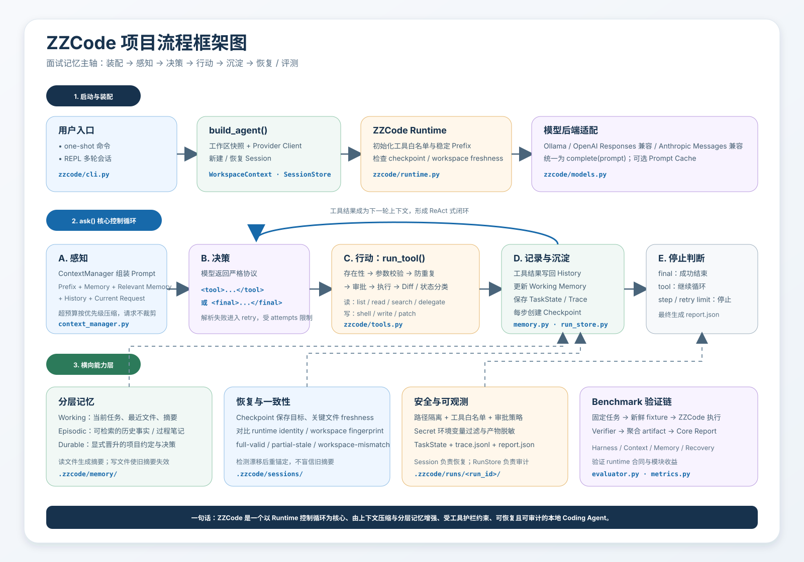
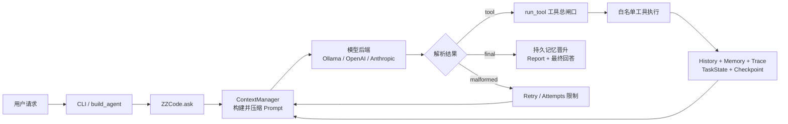

# ZZCode 项目流程框架图

[打开交互式 HTML 版本](zzcode-interview-flow.html)

## 一条主线记忆

**装配 → 感知 → 决策 → 行动 → 沉淀 → 恢复 / 评测**

1. **装配**：CLI 解析参数，构建工作区快照、模型客户端和 Session，再创建 `ZZCode` Runtime。
2. **感知**：`ContextManager` 将稳定 Prefix、分层记忆、相关记忆、历史和当前请求组装成 Prompt；超预算时分级压缩，但保留当前请求。
3. **决策**：模型只允许返回一个 `<tool>` 或 `<final>`，Runtime 负责解析和重试。
4. **行动**：所有工具统一经过存在性检查、参数校验、防重复、审批和执行后 Diff，不允许模型直接调用底层函数。
5. **沉淀**：结果写回 History 和 Working Memory，同时保存 `TaskState`、`trace.jsonl`、Checkpoint 与最终 `report.json`。
6. **恢复 / 评测**：恢复时检查文件 freshness、workspace fingerprint 和 runtime identity；Benchmark 用固定任务和 verifier 验证 Harness、Context、Memory、Recovery 四层能力。

## 核心循环

## 模块对照

| 面试概念 | 代码位置 | 作用 |
| --- | --- | --- |
| 程序入口与依赖装配 | `zzcode/cli.py` | Provider 选择、工作区采集、新建或恢复 Session |
| Agent 控制循环 | `zzcode/runtime.py` | Prompt、模型、工具、停止条件、Checkpoint 的总调度 |
| 上下文工程 | `zzcode/context_manager.py` | 分区预算、相关记忆召回、历史压缩、当前请求保护 |
| 分层记忆 | `zzcode/memory.py` | Working、Episodic、Durable Memory 与 freshness |
| 工具与安全边界 | `zzcode/tools.py` | 工具白名单、参数校验、路径约束、只读子 Agent |
| 模型适配层 | `zzcode/models.py` | 统一不同 Provider 的调用协议与缓存元数据 |
| 单次任务状态 | `zzcode/task_state.py` | attempts、tool_steps、stop_reason、checkpoint_id |
| 审计工件 | `zzcode/run_store.py` | 保存 `task_state.json`、`trace.jsonl`、`report.json` |
| 工作区上下文 | `zzcode/workspace.py` | Git 状态、项目文档、fingerprint |
| 评测体系 | `zzcode/evaluator.py`、`zzcode/metrics.py` | 固定任务、verifier、消融实验和指标聚合 |

## 模块详细拆解

### 1. CLI 与依赖装配：`zzcode/cli.py`

**为什么存在**：把命令行参数和环境变量转换成 Runtime 真正需要的对象，而不是让核心循环直接处理字符串配置。

**输入与输出**：输入是 `argparse` 解析出的参数；输出是已经装配完成的 `ZZCode` 实例。它会依次确定 Secret 名单、构建 `WorkspaceContext`、创建 `SessionStore`、选择模型客户端，并决定新建还是恢复 Session。

**关键机制**：

- Provider 支持 Ollama、OpenAI-compatible Responses API、Anthropic-compatible Messages API。
- 模型选择优先级是显式 `--model`、Provider 环境变量、代码默认值。
- `--resume latest` 会从 `.zzcode/sessions/` 找到最近一次会话。
- one-shot 和 REPL 最终都调用同一个 `agent.ask()`，所以业务逻辑没有分叉。
- `--approval ask/auto/never`、`--max-steps`、`--max-new-tokens` 都在装配时注入 Runtime。

**设计取舍**：CLI 只负责配置和生命周期，不承担 Agent 推理逻辑。这样模型后端、运行循环和交互界面可以独立替换。

**面试表达**：CLI 是 Composition Root，也就是对象图装配点；它把外部配置翻译成内部依赖，核心逻辑统一收口到 Runtime。

### 2. 工作区快照：`zzcode/workspace.py`

**为什么存在**：模型在第一次调用工具前，需要一份便宜、稳定的仓库第一印象，但不能把整个仓库内容都塞入 Prompt。

**输入与输出**：输入是当前工作目录；输出包含 repo root、当前分支、默认分支、Git status、最近 5 条提交和少量白名单项目文档。

**关键机制**：

- 只预加载 `AGENTS.md`、`README.md`、`pyproject.toml`、`package.json`，每份内容会裁剪。
- 从 repo root 和当前子目录同时扫描文档，兼顾在子目录启动的场景。
- `fingerprint()` 对工作区结构化快照做 SHA-256，用来判断稳定 Prefix 是否需要刷新。
- `.git`、`.zzcode`、虚拟环境和缓存目录不会进入工作区遍历。

**设计取舍**：这是“导航包”而不是仓库索引。优点是启动便宜、Prompt 稳定；缺点是没有读取过的源文件不会自动出现在上下文里，仍需工具按需探索。

**面试表达**：ZZCode 采用 lazy inspection，不预索引整个仓库；WorkspaceContext 只提供足够让模型开始行动的稳定基线上下文。

### 3. 模型适配层：`zzcode/models.py`

**为什么存在**：不同 Provider 的 URL、请求体、响应结构、鉴权和错误处理不同，但 Runtime 不应该感知这些差异。

**输入与输出**：统一接收 `complete(prompt, max_new_tokens, ...)`，统一返回模型文本，并把 usage、cache 等信息放入 `last_completion_metadata`。

**关键机制**：

- Ollama 使用本地生成接口；OpenAI-compatible 路径兼容 JSON 和 SSE；Anthropic-compatible 路径适配 Messages 格式。
- 网络类错误和 5xx 会有限重试，解析失败会转换成明确的 `RuntimeError`。
- OpenAI-compatible 客户端可声明 `supports_prompt_cache`，Runtime 只在后端支持时传递 Prefix hash。
- `FakeModelClient` 用脚本化输出支持确定性单元测试和 Harness regression。

**设计取舍**：这里做的是窄接口 Adapter，不试图抽象所有 Provider 能力。优点是简单可测；代价是 Provider 特有能力需要显式扩展统一接口。

**面试表达**：模型层通过 Adapter Pattern 隔离协议差异，让控制循环只依赖一个最小 `complete()` 合同。

### 4. Runtime 控制循环：`zzcode/runtime.py`

**为什么存在**：模型本身只会生成文本，Coding Agent 还需要一个平台层把文本变成可控的多步工程行为。

**输入与输出**：`ask(user_message)` 输入一次用户请求，输出最终答案或明确的停止原因；运行中会产生 Session、TaskState、Trace、Checkpoint 和 Report 等副作用。

**主循环**：

1. 把当前请求写入 Working Memory 和 Session history。
2. 创建 `TaskState` 与独立 Run 目录，记录 `run_started`。
3. 每轮构建 Prompt，必要时处理恢复状态和上下文压缩 Checkpoint。
4. 调用模型并把输出解析为 `tool`、`final` 或 `retry`。
5. `tool` 进入 `run_tool()`，结果写回历史后继续下一轮。
6. `final` 结束任务，执行 Durable Memory 晋升，写最终 Checkpoint 和 Report。
7. 命中 step limit 或 retry limit 时，以可恢复的停止状态结束。

**关键机制**：

- `tool_steps` 统计真正进入执行阶段的工具调用；`attempts` 统计模型调用次数，两者分开。
- `max_attempts = max(max_steps * 3, max_steps + 4)`，避免 malformed response 无限消耗循环。
- 模型输出支持 JSON Tool 格式和适合多行文件的 XML Tool 格式。
- 每次工具执行、上下文压缩、恢复异常和运行结束都会创建 Checkpoint。
- Prefix 由 Agent 规则、工具描述、有效示例和 WorkspaceContext 构成，并通过 hash 判断复用。

**设计取舍**：这是显式状态机式控制循环，而不是让模型隐式决定一切。平台负责预算、解析、安全、持久化和停机条件，模型只负责下一步决策。

**面试表达**：`ZZCode.ask()` 是系统中枢，本质是一个受预算约束、可观察、可恢复的 ReAct 式循环：感知、决策、行动、记录，再回到感知。

### 5. 上下文管理：`zzcode/context_manager.py`

**为什么存在**：完整历史会持续膨胀，而模型每轮真正需要的是稳定规则、当前状态、少量相关事实、近期操作和最新请求。

**输入与输出**：输入当前用户请求；输出 `(prompt, metadata)`。Metadata 会记录各区原始长度、渲染长度、压缩过程和召回结果。

**Prompt 分区顺序**：

1. `prefix`：Agent 规则、工具合同、WorkspaceContext、恢复信息。
2. `memory`：任务摘要、最近文件和仍然新鲜的文件摘要。
3. `relevant_memory`：按当前请求召回的最多 3 条 Episodic / Durable 笔记。
4. `history`：经过压缩的会话与工具历史。
5. `current_request`：本轮用户请求，始终放在最后且不裁剪。

**关键机制**：

- 默认总预算 12000 字符，各分区有独立预算和最低保留量。
- 超预算时依次压缩 Relevant Memory、History、Memory、Prefix。
- 最近 6 条历史优先保留；较早的重复 `read_file` 会合并，旧工具输出会摘要化。
- 如果已有新鲜文件摘要，旧读取结果可替换成摘要，减少重复上下文。
- Metadata 进入 Trace / Report，使 Prompt 压缩过程可解释、可评测。

**设计取舍与边界**：当前使用字符预算，不是模型 tokenizer 的精确 Token 预算。实现简单且 Provider 无关，但中英文和不同模型之间的 Token 对应关系并不完全一致。

**面试表达**：上下文工程不是简单截断，而是带优先级、分区预算和历史语义压缩的 Prompt 编排；最重要的不变量是当前请求不丢失。

### 6. 分层记忆：`zzcode/memory.py`

**为什么存在**：History 适合回放完整过程，但不适合每轮全部输入模型；记忆层保存更小、更可复用的工作集。

**三层结构**：

- **Working Memory**：当前任务摘要、最近最多 8 个文件、最多 6 个文件摘要。
- **Episodic Memory**：最多 12 条跨轮事实或过程笔记，包含 tags、source、created_at、kind。
- **Durable Memory**：显式晋升到 `.zzcode/memory/` 的长期项目约定、关键决策、依赖事实和用户偏好。

**关键机制**：

- `read_file` 后记录文件、生成短摘要并追加 Episodic Note。
- `write_file` / `patch_file` 后立即使该文件旧摘要失效。
- 文件摘要保存内容 SHA-256；恢复或渲染时 freshness 不一致就不再使用。
- 召回采用 tag 命中、关键词重叠、时间和 note index 排序，并合并 Durable 候选。
- Durable Memory 只有在用户表达“记住/保存”意图，且最终答案符合固定语义前缀时才晋升。
- Secret-shaped、临时任务状态和噪声输出会被拒绝进入 Durable Memory。

**设计取舍与边界**：召回是透明的词法匹配，不使用 Embedding 或向量数据库。它成本低、结果可解释，但同义词和语义近似召回能力有限。

**面试表达**：ZZCode 把“完整历史”和“可复用知识”分开，并用 freshness 解决代码变化后记忆过期的问题；长期记忆采用显式晋升，避免自动积累污染。

### 7. 工具与安全边界：`zzcode/tools.py` + `ZZCode.run_tool()`

**为什么存在**：Agent 的主要风险不在模型“想做什么”，而在平台是否允许它直接触碰文件系统和 Shell。

**工具集合**：`list_files`、`read_file`、`search`、`run_shell`、`write_file`、`patch_file`，以及有深度限制的 `delegate`。

**统一执行流水线**：

1. 检查工具是否在显式 Registry 中。
2. 校验必填参数、类型、行号范围、超时和 Patch 唯一命中。
3. 通过 `Path.resolve()` 和 common path 检查阻止 `../` 与符号链接逃逸。
4. 拦截连续重复的相同工具调用。
5. 对 Shell 和写文件等风险工具应用 `ask/auto/never` 审批。
6. 风险工具执行前后抓取工作区快照，生成 affected paths 与 diff summary。
7. 将结果分类为 `ok`、`error`、`partial_success` 或 `rejected`，再写入 Trace 和过程记忆。

**额外约束**：

- Shell 最长 120 秒，且只继承 allowlist 环境变量，降低 Secret 泄漏风险。
- 子 Agent 只读、`approval_policy=never`、步数更少，并受最大委派深度限制。
- 工具结果会裁剪，避免超长 stdout 直接挤爆下一轮上下文。

**设计取舍与边界**：审批、路径隔离和环境过滤是应用层护栏，不等价于容器、虚拟机或系统调用级 OS 沙箱；生产级高风险执行仍应增加进程隔离。

**面试表达**：模型永远不能直达底层工具函数，`run_tool()` 是唯一执行总闸口，把校验、授权、执行、Diff 和审计串成完整安全链路。

### 8. TaskState：`zzcode/task_state.py`

**为什么存在**：需要一个小型、结构化的状态机回答“当前任务进行到哪一步、为什么停止”，而不能只从自然语言历史猜测。

**核心字段**：`run_id`、`task_id`、`status`、`tool_steps`、`attempts`、`last_tool`、`stop_reason`、`final_answer`、`checkpoint_id`、`resume_status`。

**状态语义**：

- `running`：控制循环仍在推进。
- `completed`：模型返回有效 Final Answer。
- `stopped`：达到 step / retry 等平台停止条件。
- `failed`：模型错误等失败状态。

**设计取舍**：`status` 表示最终状态，`stop_reason` 表示导致状态变化的原因，两者分离后更容易聚合指标和定位失败类型。

**面试表达**：TaskState 是一次 `ask()` 的最小状态机快照，也是运行中观察、恢复和离线报告之间的稳定数据合同。

### 9. Session、Checkpoint 与 RunStore：`zzcode/runtime.py` + `zzcode/run_store.py`

**为什么存在**：可恢复状态和单次运行审计是两个不同需求，混在一个文件中会导致生命周期和写入模式冲突。

**三类持久化**：

- `.zzcode/sessions/<session_id>.json`：保存跨轮 History、Memory、Checkpoint 和 Runtime Identity，用于继续会话。
- `.zzcode/runs/<run_id>/task_state.json`：当前任务状态，使用临时文件加 replace 的原子写。
- `.zzcode/runs/<run_id>/trace.jsonl`：逐事件追加的时间线，运行中断时也能保留已发生事件。
- `.zzcode/runs/<run_id>/report.json`：结束时生成的结果、Prompt Metadata、记忆晋升和脱敏摘要。

**恢复判断**：

- `full-valid`：Checkpoint schema、关键文件 freshness 和 Runtime Identity 都一致。
- `partial-stale`：关键文件内容发生变化，旧文件摘要会失效并创建重锚定 Checkpoint。
- `workspace-mismatch`：模型、审批、Feature Flags、Workspace Fingerprint 或 Tool Signature 等运行身份发生变化。
- `schema-mismatch`：Checkpoint 结构版本不兼容。

**设计取舍与边界**：Workspace Fingerprint 关注 Git 状态、提交和项目文档，并不是整个仓库所有文件的内容哈希；近期关键文件通过单独 freshness 弥补这一点。

**面试表达**：Session 面向“继续工作”，Trace / Report 面向“解释和审计”；Checkpoint 则是连接两者的恢复锚点。

### 10. Evaluator 与 Metrics：`zzcode/evaluator.py` + `zzcode/metrics.py`

**为什么存在**：Agent Demo 看起来能工作，不等于系统设计真的有效；需要可重复任务、成功定义和消融对照。

**Harness 流程**：

1. 校验 Benchmark schema、任务 ID、fixture、step budget、verifier 等字段。
2. 每个任务复制一份全新的 fixture，避免运行之间相互污染。
3. 创建独立 Workspace、SessionStore、RunStore 和 Agent。
4. 执行任务后检查预期工件、Verifier 返回码、工具预算和 Stop Reason。
5. 保存每行结果、运行环境、fixture snapshot、模型配置和失败分类。

**消融实验**：

- Context：完整配置对比关闭压缩，观察 Prompt 长度与当前请求保留率。
- Memory：Memory On / Off / Irrelevant，观察重复读取、工具步数、正确率和命中率。
- Recovery：验证 stale summary 重锚定、workspace drift detection、resume false accept。
- Security / Provider：补充安全事件和真实 Provider 行为，但不与核心模块收益混写。

**成功定义**：任务通过需要同时满足工件存在、Verifier 通过、工具步数在预算内，并以非失败 Stop Reason 结束。

**设计取舍与边界**：Harness regression 证明的是 Runtime 合同稳定，不代表模型能力上限。当前 Benchmark 的 `allowed_tools` 会被校验并记录，但没有在 `run_task()` 中动态裁剪 Agent Registry，因此不应声称它已经形成逐任务强制工具隔离。

**面试表达**：评测分成“系统合同回归”和“模块消融收益”两层，避免把确定性 Harness、真实 Provider 表现和单模块收益混成一个结论。

## 三条跨模块时序链路

### 正常工具调用链

`CLI → ZZCode.ask → ContextManager.build → ModelClient.complete → ZZCode.parse → run_tool → Tool Registry → History / Memory → TaskState / Trace / Checkpoint → 下一轮 Prompt`

### 最终回答链

`Model Final → Session History → TaskState.completed → Durable Memory 过滤与晋升 → Final Checkpoint → report.json → 返回 CLI`

### 恢复链

`CLI --resume → SessionStore.load → ZZCode 初始化 → 清理 stale file summary → 对比 Checkpoint 与 Runtime Identity → 将恢复状态写入 Prompt → 必要时重新读取关键文件并创建新 Checkpoint`

## 3 分钟项目介绍模板

这个项目叫 ZZCode，是一个运行在本地代码仓库中的轻量 Coding Agent。我做它的重点不是单纯接一个大模型 API，而是补齐模型外部的 Agent Runtime：让模型能够在真实仓库中多步工作，同时做到上下文可控、工具安全、状态可恢复、过程可审计。

系统入口在 `cli.py`。CLI 会根据参数装配工作区快照、模型 Provider、SessionStore 和审批策略，然后统一进入 `ZZCode.ask()`。`ask()` 是整个系统的控制循环：每一轮先由 `ContextManager` 组装 Prompt，再调用模型；模型只能返回 Tool Call 或 Final Answer。如果返回工具调用，就进入统一的 `run_tool()` 总闸口，经过工具白名单、参数校验、路径隔离、防重复调用和风险审批后才能执行。工具结果会写回历史和工作记忆，再进入下一轮决策。

上下文方面，我没有直接把全部历史塞给模型，而是拆成 Prefix、Working Memory、Relevant Memory、History 和 Current Request 五段。每段有独立字符预算，超限时按优先级压缩，当前请求始终保留。历史压缩也不是简单截断：最近操作优先保留，旧的重复文件读取会合并，已有新鲜文件摘要时会复用摘要。

记忆方面分成 Working、Episodic 和 Durable 三层。Working 保存当前任务和最近文件；Episodic 保存少量跨轮事实；Durable 只在用户显式要求保存时，经过格式和安全过滤后持久化。文件摘要带内容哈希，文件被修改或恢复时发现 freshness 不一致，就让旧摘要失效，避免 Agent 使用过期信息。

为了支持恢复和排查，我把 Session 与 Run Artifacts 分开：Session 保存跨轮状态；每次请求独立生成 TaskState、Trace、Checkpoint 和 Report。恢复时不仅加载旧摘要，还会对比关键文件 freshness、Workspace Fingerprint 和 Runtime Identity，检测工作区或运行配置是否漂移。

最后我用固定 Harness 和消融实验验证设计。Harness 的 12 个任务通过率、预算内完成率和 Verifier 通过率都是 100%；Context 实验平均压缩 16.19%，最大 33.28%，当前请求保留率 100%；Memory On 的重复读取为 0，而 Memory Off 为 60；Recovery 的 workspace drift detection 是 100%，false accept 是 0%。这些数字分别证明 Runtime 合同、上下文压缩、记忆收益和恢复检测，但我不会把它们夸大成模型能力上限。

## 面试可引用数据

| 证明目标 | 指标 | 当前结果 | 回答边界 |
| --- | --- | --- | --- |
| Runtime 合同稳定 | 12 个 Harness 任务 | pass / within budget / verifier 均为 100% | 不代表真实模型能力上限 |
| 上下文压缩有效 | 平均 / 最大压缩率 | 16.19% / 33.28% | 基于字符长度，不是精确 Token 成本 |
| 当前请求不丢失 | preserved rate | 100% | 证明当前测试矩阵中的不变量 |
| 记忆减少重复读取 | Memory On / Off | 0 / 60 次 | 证明当前依赖任务中的模块收益 |
| 恢复检测工作区漂移 | detection rate | 100% | 不代表所有外部状态变化均可检测 |
| 避免错误恢复 | false accept rate | 0% | 当前 Recovery Benchmark 口径 |

## 60 秒面试复述

ZZCode 是一个运行在本地代码仓库里的轻量 Coding Agent。CLI 先完成模型、工作区和 Session 的装配，真正的核心是 `ZZCode.ask()` 控制循环：每轮由 `ContextManager` 把工作区信息、分层记忆、历史和当前请求组成 Prompt，模型再返回工具调用或最终答案。工具调用不会直接执行，而是统一经过白名单、参数校验、防重复、审批、路径隔离和结果 Diff。执行结果会回写 History 与 Working Memory，并持续生成 TaskState、Trace 和 Checkpoint，因此系统既能解释每一步，也能在恢复时检测文件过期或工作区漂移。最后项目通过固定 Harness 和 Context、Memory、Recovery 消融实验验证 runtime 合同与各模块收益。

## 高频追问抓手

- **为什么不是纯聊天机器人？** 它能在受约束的工具循环里读取、修改并验证真实仓库。
- **如何控制上下文成本？** 稳定 Prefix 可缓存，历史与记忆按分区预算压缩，当前请求始终保留。
- **如何避免重复读文件？** 文件摘要和 episodic note 进入 Working Memory，下一轮按请求召回。
- **如何保证恢复可靠？** Checkpoint 不只存摘要，还存关键文件 freshness、workspace fingerprint 和 runtime identity。
- **如何保证工具安全？** 工具显式注册；写操作需要审批；路径必须位于 workspace；Shell 环境使用 allowlist；Trace 和 Report 会脱敏。
- **如何证明设计有效？** Harness 验证运行合同，三类消融分别验证上下文压缩、记忆减少重复读取、恢复检测漂移。
